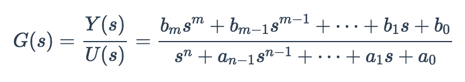

# ndarray-tf2ss
Converts a transfer function representation to state space.

## Usage

The transfer function is defined using the following notation:



With that convention, some pseudocode for usage would be:

```
y = [bm, ... , b1, b0];
x = [1, an-1, ..., a1, a0];
[A, B, C, D] = require('ndarray-tf2ss')(y, x);
```

The `y` and `x` arguments need to be ndarrays. Each row in the input arguments defines a separate function to be calculated.

* Single input-single output (SISO) systems can be defined with y having a single row and x having a single row.
* Single input-multiple output (SIMO) systems can be defined with y having multiple rows and x having a single row.
* Multiple input-multiple output (MIMO) systems can be defined with y having multiple rows and x having multiple rows.

## Description

A [transfer function](https://en.wikipedia.org/wiki/Transfer_function) typically relates the input of a system to an output. Control systems may need a [state-space representation](https://en.wikipedia.org/wiki/State-space_representation), and this function can convert the transfer function to the necessary matrices, which will be [ndarrays](https://github.com/scijs/ndarray).

State-space control needs 4 matrices and they satisfy the equations:

```
dx = Ax + Bu
y = Cx + Du
```
where `dx` is the derivative of the state variables. Note that the D matrix is zero. If m < n, the D matrix will always be zero. For causality (i.e. that we don't have to take into account future inputs), m ≤ n.

## Author

Tim Bright

## License

&copy; 2016, Tim Bright. MIT License.
